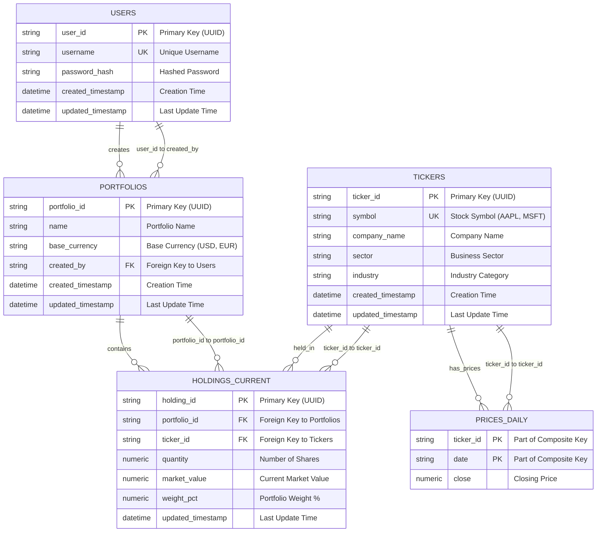

# Portfolio Database Design

## What This System Does

The **Portfolio Insight & Research Platform** is designed to provide users with actionable insights into their investment portfolios by combining structured financial data with unstructured research materials. The system ingests and processes data from multiple sources—both internal and external—leveraging a Relational Database for structured portfolio data, a Vector Database for semantic search over unstructured text, and LLM-powered RAG pipelines for intelligent querying and insights.

### Core Capabilities

This is a **Portfolio Management System** that helps users track their investments and gain intelligent insights. Think of it like a digital investment portfolio where you can:

- **Create multiple portfolios** (e.g., "Retirement 401k", "Day Trading", "Crypto")
- **Add different stocks/ETFs** to each portfolio (e.g., Apple, Microsoft, Tesla)
- **Track quantities and values** of your holdings
- **Store historical price data** for analysis
- **Integrate research materials** for AI-powered insights
- **Query unstructured data** using semantic search
- **Get intelligent recommendations** through RAG pipelines

## Our Database Schema

### Entity Relationship Diagram (ERD)



### How Tables Connect

```
👤 USERS (1) ──→ (many) 📁 PORTFOLIOS
    │
    └── One user can have multiple portfolios
    └── Each portfolio belongs to exactly one user

📁 PORTFOLIOS (1) ──→ (many) 📊 HOLDINGS_CURRENT
    │
    └── One portfolio can have multiple holdings
    └── Each holding belongs to exactly one portfolio

🏷️ TICKERS (1) ──→ (many) 📊 HOLDINGS_CURRENT
    │
    └── One ticker can be held in multiple portfolios
    └── Each holding references exactly one ticker

🏷️ TICKERS (1) ──→ (many) 💰 PRICES_DAILY
    │
    └── One ticker can have multiple daily prices
    └── Each price belongs to exactly one ticker
```

## Real Example: John Doe's Portfolio

### What John Has:
- **User**: John Doe (username: "john_doe")
- **Portfolio**: "Senator John Doe's Portfolio" 
- **Holdings**: 
  - Apple (AAPL): 100 shares worth $15,025
  - Microsoft (MSFT): 50 shares worth $15,000
  - Tesla (TSLA): 25 shares worth $5,000

### How It's Stored:

**Portfolio Table (1 row):**
```
portfolio_id: "21a6f57e-4355-4ffc-babd-d1157b57336f"
name: "Senator John Doe's Portfolio"
base_currency: "USD"
created_by: "john_doe"
```

**Holdings Table (3 rows):**
```
holding_id: "h1" | portfolio_id: "21a6f57e..." | ticker: "AAPL" | quantity: 100 | value: $15,025
holding_id: "h2" | portfolio_id: "21a6f57e..." | ticker: "MSFT" | quantity: 50  | value: $15,000
holding_id: "h3" | portfolio_id: "21a6f57e..." | ticker: "TSLA" | quantity: 25  | value: $5,000
```

**Tickers Table (3 rows):**
```
ticker_id: "AAPL" | symbol: "AAPL" | company: "Apple Inc." | sector: "Technology"
ticker_id: "MSFT" | symbol: "MSFT" | company: "Microsoft Corp" | sector: "Technology"
ticker_id: "TSLA" | symbol: "TSLA" | company: "Tesla Inc" | sector: "Automotive"
```

## Current Database Schema (SQLAlchemy Models)

### Users Table
```python
class User(Base):
    __tablename__ = "users"  # Table name in database
    
    # Primary key: Unique identifier for each user
    user_id = Column(String, primary_key=True, default=lambda: str(uuid.uuid4()))
    
    # Username: Unique login identifier (max 50 characters)
    username = Column(String(50), unique=True, nullable=False)
    
    # Password: Hashed password for authentication (not plain text)
    password_hash = Column(String, nullable=False)
    
    # Timestamps: Track when user was created and last updated
    created_timestamp = Column(DateTime(timezone=True), server_default=func.now())
    updated_timestamp = Column(DateTime(timezone=True), server_default=func.now(), onupdate=func.now())
```

### Tickers Table
```python
class Ticker(Base):
    __tablename__ = "tickers"  # Table name in database
    
    # Primary key: Unique identifier for each stock/ETF/crypto
    ticker_id = Column(String, primary_key=True, default=lambda: str(uuid.uuid4()))
    
    # Symbol: Stock ticker symbol (e.g., 'AAPL', 'MSFT', 'BTC-USD')
    symbol = Column(String(16), unique=True, nullable=False)
    
    # Company name: Full company name (e.g., 'Apple Inc.')
    company_name = Column(String(256))
    
    # Sector: Business sector (e.g., 'Technology', 'Healthcare')
    sector = Column(String(128))
    
    # Industry: Specific industry within sector (e.g., 'Consumer Electronics')
    industry = Column(String(128))
    
    # Timestamps: Track when ticker was added and last updated
    created_timestamp = Column(DateTime(timezone=True), server_default=func.now())
    updated_timestamp = Column(DateTime(timezone=True), server_default=func.now(), onupdate=func.now())
```

### Portfolios Table
```python
class Portfolio(Base):
    __tablename__ = "portfolios"  # Table name in database
    
    # Primary key: Unique identifier for each portfolio
    portfolio_id = Column(String, primary_key=True, default=lambda: str(uuid.uuid4()))
    
    # Name: Portfolio display name (e.g., 'Retirement 401k', 'Day Trading')
    name = Column(String(128), nullable=False)
    
    # Base currency: Portfolio's base currency (e.g., 'USD', 'EUR', 'BTC')
    base_currency = Column(String(8), nullable=False, default='USD')
    
    # Created by: Foreign key to users table (who owns this portfolio)
    created_by = Column(String, ForeignKey('users.user_id'), nullable=False)
    
    # Timestamps: Track when portfolio was created and last updated
    created_timestamp = Column(DateTime(timezone=True), server_default=func.now())
    updated_timestamp = Column(DateTime(timezone=True), server_default=func.now(), onupdate=func.now())
    
    # Relationships: One portfolio can have many holdings
    holdings = relationship("HoldingCurrent", back_populates="portfolio", cascade="all, delete-orphan")
```

### Holdings Current Table
```python
class HoldingCurrent(Base):
    __tablename__ = "holdings_current"  # Table name in database
    
    # Primary key: Unique identifier for each holding
    holding_id = Column(String, primary_key=True, default=lambda: str(uuid.uuid4()))
    
    # Portfolio ID: Foreign key to portfolios table (which portfolio this belongs to)
    portfolio_id = Column(String, ForeignKey('portfolios.portfolio_id', ondelete='CASCADE'), nullable=False)
    
    # Ticker ID: Foreign key to tickers table (which stock/ETF this is)
    ticker_id = Column(String, ForeignKey('tickers.ticker_id', ondelete='RESTRICT'), nullable=False)
    
    # Quantity: Number of shares/units held (supports up to 8 decimal places)
    quantity = Column(Numeric(24, 8), nullable=False, default=0)
    
    # Market value: Current market value of this holding in portfolio's base currency
    market_value = Column(Numeric(24, 8), nullable=False, default=0)
    
    # Weight percentage: This holding's percentage of total portfolio value (0-100)
    weight_pct = Column(Numeric(8, 4))
    
    # Updated timestamp: When this holding was last updated
    updated_timestamp = Column(DateTime(timezone=True), server_default=func.now(), onupdate=func.now())
    
    # Relationships: Link back to portfolio and ticker
    portfolio = relationship("Portfolio", back_populates="holdings")
    ticker = relationship("Ticker")
    
    # Constraints: Prevent duplicate holdings (same portfolio + same ticker)
    __table_args__ = (
        UniqueConstraint('portfolio_id', 'ticker_id', name='uq_hc_portfolio_ticker'),
    )
```

### Prices Daily Table
```python
class PriceDaily(Base):
    __tablename__ = "prices_daily"  # Table name in database
    
    # Composite primary key: ticker_id + date
    # Ticker ID: Foreign key to tickers table (which stock this price is for)
    ticker_id = Column(String, ForeignKey('tickers.ticker_id', ondelete='CASCADE'), nullable=False, primary_key=True)
    
    # Date: Trading date (stored as string for SQLite compatibility)
    date = Column(String, nullable=False, primary_key=True)
    
    # Close price: Closing price for this ticker on this date
    close = Column(Numeric(20, 6), nullable=False)
```

## Schema Relationships

### Entity Relationship Diagram (ERD)


### Relationship Types and Keys

#### 1. **One-to-Many (1:N) Relationships**

| **Parent Table** | **Child Table** | **Foreign Key** | **Description** |
|------------------|-----------------|-----------------|-----------------|
| `USERS` | `PORTFOLIOS` | `created_by` → `user_id` | One user can create many portfolios |
| `PORTFOLIOS` | `HOLDINGS_CURRENT` | `portfolio_id` → `portfolio_id` | One portfolio can contain many holdings |
| `TICKERS` | `HOLDINGS_CURRENT` | `ticker_id` → `ticker_id` | One ticker can be held in many portfolios |
| `TICKERS` | `PRICES_DAILY` | `ticker_id` → `ticker_id` | One ticker can have many daily prices |

#### 2. **Many-to-Many (M:N) Relationships**

| **Table A** | **Table B** | **Junction Table** | **Description** |
|-------------|-------------|-------------------|-----------------|
| `PORTFOLIOS` | `TICKERS` | `HOLDINGS_CURRENT` | Many portfolios can hold many tickers |

#### 3. **Composite Primary Keys**

| **Table** | **Composite Key** | **Description** |
|-----------|-------------------|-----------------|
| `PRICES_DAILY` | `(ticker_id, date)` | Unique price per ticker per date |

#### 4. **Unique Constraints**

| **Table** | **Constraint** | **Description** |
|-----------|----------------|-----------------|
| `HOLDINGS_CURRENT` | `(portfolio_id, ticker_id)` | One ticker per portfolio (no duplicates) |
| `USERS` | `username` | Unique username |
| `TICKERS` | `symbol` | Unique ticker symbol |

### Data Flow Example
```
User "john_doe" creates Portfolio "Retirement 401k"
├── Portfolio ID: "portfolio-123"
├── Holdings:
│   ├── AAPL: 100 shares ($15,025)
│   ├── MSFT: 50 shares ($15,000)
│   └── TSLA: 25 shares ($5,000)
└── Daily Prices:
    ├── AAPL: $150.25 (2024-01-15)
    ├── MSFT: $300.00 (2024-01-15)
    └── TSLA: $200.00 (2024-01-15)
```

### Relationship Cardinality Summary

```
USERS (1) ──→ (N) PORTFOLIOS
    │
    └── user_id ← created_by
    │
    └── One user can have multiple portfolios
    └── Each portfolio belongs to exactly one user

PORTFOLIOS (1) ──→ (N) HOLDINGS_CURRENT
    │
    └── portfolio_id ← portfolio_id
    │
    └── One portfolio can have multiple holdings
    └── Each holding belongs to exactly one portfolio

TICKERS (1) ──→ (N) HOLDINGS_CURRENT
    │
    └── ticker_id ← ticker_id
    │
    └── One ticker can be held in multiple portfolios
    └── Each holding references exactly one ticker

TICKERS (1) ──→ (N) PRICES_DAILY
    │
    └── ticker_id ← ticker_id
    │
    └── One ticker can have multiple daily prices
    └── Each price belongs to exactly one ticker

PORTFOLIOS (M) ──→ (N) TICKERS
    │
    └── Through HOLDINGS_CURRENT junction table
    │
    └── Many portfolios can hold many tickers
    └── Many tickers can be held in many portfolios
```

## Real Example: John Doe's Portfolio

### Before (JSON Approach) ❌

```json
{
  "portfolio_id": "21a6f57e-4355-4ffc-babd-d1157b57336f",
  "name": "Senator John Doe's Portfolio",
  "base_currency": "USD",
  "created_by": "test-user-123",
  "holdings": {
    "AAPL": 100,
    "MSFT": 50,
    "TSLA": 25
  }
}
```

### After (Normalized Approach) ✅

**Portfolio Table (1 row):**
```
portfolio_id: "21a6f57e-4355-4ffc-babd-d1157b57336f"
name: "Senator John Doe's Portfolio"
base_currency: "USD"
created_by: "test-user-123"
created_timestamp: "2024-01-15 10:30:00"
```

**Holdings Table (3 rows):**
```
holding_id: "4643f449-9120-4bb9-a692-353095fa2225" | portfolio_id: "21a6f57e..." | ticker_id: "AAPL" | quantity: 100 | market_value: 15025
holding_id: "h2" | portfolio_id: "21a6f57e..." | ticker_id: "MSFT" | quantity: 50  | market_value: 15000
holding_id: "h3" | portfolio_id: "21a6f57e..." | ticker_id: "TSLA" | quantity: 25  | market_value: 5000
```

**Tickers Table (3 rows):**
```
ticker_id: "AAPL" | symbol: "AAPL" | company_name: "Apple Inc." | sector: "Technology"
ticker_id: "MSFT" | symbol: "MSFT" | company_name: "Microsoft Corp" | sector: "Technology"
ticker_id: "TSLA" | symbol: "TSLA" | company_name: "Tesla Inc" | sector: "Automotive"
```

## Benefits of Normalized Design

### 1. **Query Flexibility**
```sql
-- Find all portfolios holding AAPL
SELECT p.name, h.quantity, h.market_value
FROM portfolios p
JOIN holdings_current h ON p.portfolio_id = h.portfolio_id
JOIN tickers t ON h.ticker_id = t.ticker_id
WHERE t.symbol = 'AAPL';

-- Get portfolio summary
SELECT 
    p.name,
    COUNT(h.holding_id) as num_holdings,
    SUM(h.market_value) as total_value
FROM portfolios p
LEFT JOIN holdings_current h ON p.portfolio_id = h.portfolio_id
WHERE p.created_by = 'test-user-123'
GROUP BY p.portfolio_id, p.name;
```

### 2. **Data Integrity**
```sql
-- Foreign key constraints ensure data consistency
ticker_id REFERENCES tickers(ticker_id)  -- Must exist in tickers table
portfolio_id REFERENCES portfolios(portfolio_id)  -- Must exist in portfolios table

-- Unique constraints prevent duplicates
CONSTRAINT uq_hc_portfolio_ticker UNIQUE (portfolio_id, ticker_id)

-- Check constraints validate data
quantity NUMERIC(24,8) NOT NULL DEFAULT 0  -- Must be a number
```

### 3. **Performance**
```sql
-- Indexed relationships for fast queries
CREATE INDEX idx_holdings_portfolio_id ON holdings_current(portfolio_id);
CREATE INDEX idx_holdings_ticker_id ON holdings_current(ticker_id);
CREATE INDEX idx_tickers_symbol ON tickers(symbol);

-- Fast aggregation queries
SELECT SUM(market_value) FROM holdings_current WHERE portfolio_id = '123';
```

### 4. **Scalability**
- ✅ **Unlimited portfolios per user**
- ✅ **Unlimited holdings per portfolio**
- ✅ **Any asset type** (stocks, ETFs, crypto, etc.)
- ✅ **No schema changes** needed for new stocks

### 5. **Maintainability**
```sql
-- Easy to add new holdings
INSERT INTO holdings_current (portfolio_id, ticker_id, quantity, market_value)
VALUES ('portfolio-123', 'new-stock-ticker', 100, 5000);

-- Easy to update holdings
UPDATE holdings_current 
SET quantity = 150, market_value = 7500
WHERE portfolio_id = 'portfolio-123' AND ticker_id = 'AAPL';

-- Easy to remove holdings
DELETE FROM holdings_current 
WHERE portfolio_id = 'portfolio-123' AND ticker_id = 'TSLA';
```

## Database Normalization Principles

### First Normal Form (1NF)
- Each column contains atomic values
- No repeating groups or arrays

### Second Normal Form (2NF)
- All non-key columns depend on the entire primary key
- No partial dependencies

### Third Normal Form (3NF)
- No transitive dependencies
- Each table represents one "thing"

## When JSON Might Be Acceptable

There are rare cases where JSON might be okay:

```sql
-- ✅ OK: Configuration data
CREATE TABLE user_preferences (
  user_id UUID,
  preferences JSON  -- {"theme": "dark", "notifications": true}
);

-- ✅ OK: Log data
CREATE TABLE api_logs (
  log_id UUID,
  request_data JSON  -- {"headers": {...}, "body": {...}}
);

-- ❌ BAD: Relational data
CREATE TABLE portfolios (
  portfolio_id UUID,
  holdings JSON  -- This should be normalized!
);
```

## Summary

**The key principle:** When designing database schemas, avoid storing relational data as JSON lists or arrays. Instead, use separate normalized tables with foreign key relationships.

**Benefits:**
- ✅ **Fast queries** with proper indexes
- ✅ **Data integrity** with constraints
- ✅ **Easy maintenance** and updates
- ✅ **Scalability** for unlimited data
- ✅ **Standard SQL operations** work efficiently

**Our portfolio schema follows this principle by separating:**
- `portfolios` table (portfolio metadata)
- `holdings_current` table (holdings data)
- `tickers` table (stock metadata)

This design is used by every major financial platform (Bloomberg, Yahoo Finance, etc.) because it's the industry standard for handling complex relational data efficiently.

---

## Why We Separate Tables

### The Problem with Single Table + JSON

Instead of storing everything in one table with JSON:
```sql
-- ❌ BAD: Everything in one table
CREATE TABLE portfolios (
  portfolio_id UUID PRIMARY KEY,
  name VARCHAR(128),
  holdings JSON  -- {"AAPL": 50, "MSFT": 100, "TSLA": 25}
);
```

**Problems:**
- **Slow queries**: `SELECT * FROM portfolios WHERE holdings->>'AAPL' IS NOT NULL`
- **No validation**: JSON allows invalid data like `{"AAPL": "fifty"}`
- **Poor performance**: No indexes, full table scans
- **Schema explosion**: Would need 10,000+ columns for all stocks

### The Solution: Normalized Tables

**✅ Good Design: Separate tables with relationships**
- `portfolios` table: Portfolio metadata (1 row per portfolio)
- `holdings_current` table: Holdings data (1 row per holding)
- `tickers` table: Stock metadata (1 row per stock)

### Key Benefits

1. **Fast Queries**: Indexed relationships enable efficient JOINs
2. **Data Integrity**: Foreign key constraints prevent invalid data
3. **Scalability**: Unlimited portfolios and holdings without schema changes
4. **Maintainability**: Easy to add/update/delete individual holdings

### Database Normalization

Follows **Third Normal Form (3NF)**:
- Each table represents one "thing"
- No repeating groups or arrays
- All columns depend on the primary key

**Result**: Clean, efficient, industry-standard database design used by Bloomberg, Yahoo Finance, and other major financial platforms.
