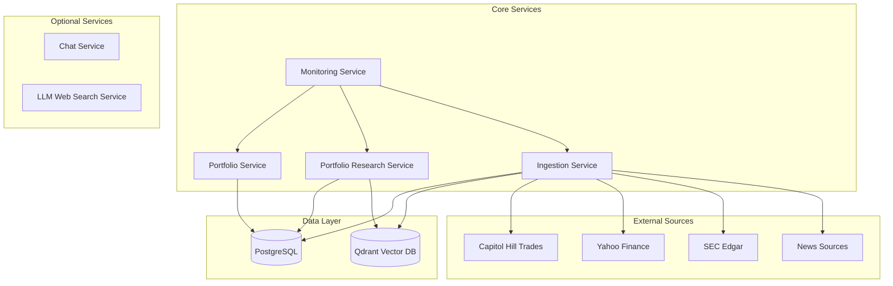

# Portfolio Insight & Research Platform - Design Document

## Overview

The Portfolio Insight & Research Platform is designed to provide users with actionable insights into their investment portfolios by combining structured financial data with unstructured research materials. The system ingests and processes data from multiple sources—both internal and external—leveraging a Relational Database for structured portfolio data, a Vector Database for semantic search over unstructured text, and LLM-powered RAG pipelines for intelligent querying and insights.

## Goals and Objectives

- **Automate portfolio updates** by integrating with real-time financial data sources
- **Aggregate structured and unstructured data** to create a holistic view of the user's investments
- **Enhance investment decisions** with AI-driven research summaries and recommendations
- **Enable natural language queries** using LLM and Text-to-SQL techniques
- **Provide a scalable, monitored, and modular system** that supports future expansion (new asset types, data sources)

## Technology Stack

| **Layer** | **Technology** | **Purpose** |
|-----------|----------------|-------------|
| **Web Framework** | Python FastAPI | Backend API |
| **Relational Database** | PostgreSQL | Structured data storage |
| **Vector Database** | Qdrant | Semantic search & RAG |
| **LLM Framework** | LlamaIndex | RAG integration |
| **Data Ingestion** | Custom scripts | Data collection |
| **Monitoring** | Prometheus + Grafana | Metrics & alerts |
| **Data Sources** | Firecrawl, yfinance | Financial data fetching |
| **AI Assistant** | Claude 3.7 Extended | AI-assisted coding |

### Key Technology Links

- **Qdrant Vector DB**: https://qdrant.tech/
- **LlamaIndex + Qdrant**: https://docs.llamaindex.ai/en/stable/examples/vector_stores/QdrantIndexDemo
- **SEC Edgar Downloads**: https://github.com/sec-edgar/sec-edgar
- **Text-to-SQL**: https://docs.llamaindex.ai/en/stable/examples/index_structs/struct_indices/SQLIndexDemo/
- **Yahoo Finance Python**: https://github.com/ranaroussi/yfinance/tree/main
- **Prometheus Python**: https://github.com/prometheus/client_python
- **Firecrawl**: https://www.firecrawl.dev/
- **OpenAI Web Search**: https://platform.openai.com/docs/guides/tools-web-search?api-mode=responses

## System Architecture

### Services Overview



## Service Specifications

### 1. Portfolio Service

**Purpose**: Manages structured portfolio data & stock data for each user.

#### Data Sources
- **Portfolio data**: Firecrawl to scrape from Capitol Hill Trades
- **Stock data**: yfinance (Yahoo Finance) for market updates

#### Data Storage
All structured data stored in PostgreSQL:
- **Portfolio table**: Portfolio metadata (owner, name, etc.)
- **Stock table**: Individual stock records with `portfolio_id` foreign key
- **Benefits**: Better normalization, independent stock queries, cleaner joins with market data

#### Core APIs

**Portfolio Management:**
- `POST /portfolios` → Create a new portfolio (with optional initial holdings)
- `GET /portfolios` → List all portfolios for current user
- `GET /portfolios/{portfolioId}` → Retrieve specific portfolio (with holdings and metrics)

**Optional Portfolio APIs:**
- `POST /portfolios/update` → Update portfolios
  ```json
  {
    "portfolioId": "uuid",
    "metadata": {"name": "Tech Growth"},
    "holdings": {
      "add": [{"ticker": "MSFT", "quantity": 10, "purchase_price": 300}],
      "update": [{"holding_id": "h-123", "quantity": 60}],
      "remove": ["h-456"]
    }
  }
  ```
- `DELETE /portfolios/{portfolioId}` → Delete entire portfolio
- `GET /portfolios/search?name=Tech` → Search portfolios by name, tag, or asset type

**Stock Management:**
- `GET /portfolios/{portfolioId}/stocks` → Get all stocks in a portfolio
- `POST /portfolios/{portfolioId}/stocks/` → Add a stock to a portfolio

**Optional Stock APIs:**
- `DELETE /portfolios/{portfolioId}/stocks/delete/{stockId}` → Remove a stock from a portfolio
- `PATCH /portfolios/{portfolioId}/stocks/{stockId}` → Partial update of a single stock lot
- `GET /stocks/{ticker}` → Fetch real-time stock info from yfinance

### 2. Portfolio Research Service

**Purpose**: Transform user portfolios + external content (10-Q, research, news) into actionable insights using RAG over vector DB and optional text-to-SQL over PostgreSQL.

#### Core APIs

**`POST /research/insights`**
- **Purpose**: Generate portfolio insights (allocation risks, concentration, earnings exposure, sentiment)
- **Request Body**:
  ```json
  {
    "portfolioId": "uuid",
    "question": "Where are my top sector risks next quarter?"
  }
  ```
- **Response**:
  ```json
  {
    "status": "OK",                          // "OK" | "INSUFFICIENT_CONTEXT"
    "answer": "Risk is concentrated in IT…", // null if insufficient
    "citations": [                          
      {"documentId": "aapl-10q-2025Q2", "url": "https://..."}
    ],
    "traceId": "r-abc123"                    // for logs/metrics
  }
  ```

**`POST /research`**
- **Purpose**: Direct semantic query over 10-Q/research/news (vector DB)
- **Request Body**:
  ```json
  {
    "portfolioId": "uuid",
    "query": "Summarize liquidity risks for AAPL and MSFT from last 10-Q",
    "filters": { "tickers": ["AAPL","MSFT"], "dateFrom": "2024-01-01" },
    "topK": 8,
    "strategy": "auto",         // auto | rag | sql | hybrid
    "executeSql": true,         // if strategy may include SQL
    "abstainThreshold": 0.55    // if retrieval confidence < threshold → abstain
  }
  ```
- **Response**:
  ```json
  {
    "status": "OK",             // OK | INSUFFICIENT_CONTEXT | PARTIAL
    "answer": "...",
    "citations": [
      {"documentId":"aapl-10q-2025Q2","chunkId":"c-17","score":0.82,"url":"..."},
      {"documentId":"msft-10q-2025Q2","chunkId":"c-21","score":0.78,"url":"..."}
    ],
    "sql": {                    // present when strategy ran SQL
      "generated": "SELECT ...",
      "rows": [{"ticker":"AAPL","unrealized_gain":12345.67}],
      "executed": true
    },
    "confidence": 0.73,
    "traceId": "r-7b2f..."
  }
  ```

#### Text-to-SQL Flow

**`/research` (execute_sql=true)**:
1. Feed `query` + database schema to T2SQL
2. Generate SQL and execute in PostgreSQL
3. Return results directly or summarize via LLM

**`/research` (execute_sql=false)**:
- Only semantic retrieval/RAG, return hits and optional answer

**`/research/insights`**:
- Orchestration layer that internally calls `/research` with `execute_sql=true`
- Combines structured data with retrieved fragments for insights

#### Embedding-based Router
- Keep canonical examples for each action type
- Compute cosine similarity with multilingual embeddings
- Thresholded decision: high confidence → route, low confidence → ask for clarification

### 3. Monitoring Service

**Purpose**: Track system health, performance, and data ingestion metrics.

#### Core APIs
- `GET /health` - Service health check
- `POST /metrics` - Push service metrics
- `GET /metrics` - Retrieve metrics dashboard

### 4. Ingestion Service (Optional)

**Purpose**: Orchestrate data collection from multiple sources and populate both relational and vector databases.

#### Source Registry
- `POST /ingest/sources` - Register a data source
  ```json
  {
    "name": "capitol-hill-trades",
    "type": "scrape",
    "config": { "entryUrls": ["https://..."], "schedule": "0 */6 * * *" },
    "enabled": true
  }
  ```
- `GET /ingest/sources` - List sources
- `GET /ingest/sources/{sourceId}` - Get specific source
- `PATCH /ingest/sources/{sourceId}` - Update config
- `DELETE /ingest/sources/{sourceId}` - Remove source

#### Run Control
- `POST /ingest/runs` - Start a manual ingestion run
  ```json
  {
    "sourceIds": ["capitol-hill-trades","yfinance-prices","sec-10q"],
    "filters": { "tickers": ["AAPL","MSFT"], "dateFrom": "2024-01-01" }
  }
  ```
- `GET /ingest/runs` - List recent runs
- `GET /ingest/runs/{runId}` - Get run status/progress
- `POST /ingest/runs/{runId}/cancel` - Cancel a run

#### Structured Data → PostgreSQL
- `POST /ingest/structured/trades` - Upsert Capitol Hill trades
- `POST /ingest/structured/prices` - Upsert OHLC data from yfinance
- `POST /ingest/structured/portfolios` - Bulk import portfolio data

#### Unstructured Data → Vector DB (TODO)
- `POST /ingest/unstructured/docs` - Ingest documents (10-Q PDFs, research, news)
- `DELETE /ingest/unstructured/docs/{documentId}` - Remove document
- `GET /ingest/unstructured/docs/{documentId}` - Get document metadata

#### Quality & Coverage
- `GET /ingest/quality/report?since=2025-08-01&tickers=AAPL,MSFT` - Coverage report
- `GET /ingest/coverage/gaps?tickers=AAPL` - Identify missing data

### 5. Optional Services

#### Chat Service
- Send/receive messages from LLM API
- Real-time conversation interface

#### LLM Web Search Service
- Web search capabilities using OpenAI tools
- Enhanced research capabilities

## Database Schema

### Relational Database (PostgreSQL)

```sql
-- ========== Users ==========
CREATE TABLE users (
  user_id UUID PRIMARY KEY DEFAULT uuid_generate_v4(),
  username VARCHAR(50) UNIQUE NOT NULL,
  password_hash TEXT NOT NULL,
  created_timestamp TIMESTAMPTZ NOT NULL DEFAULT CURRENT_TIMESTAMP,
  updated_timestamp TIMESTAMPTZ NOT NULL DEFAULT CURRENT_TIMESTAMP
);

-- ========== Tickers (master data of stocks; no prices here) ==========
CREATE TABLE tickers (
  ticker_id UUID PRIMARY KEY DEFAULT uuid_generate_v4(),
  symbol VARCHAR(16) UNIQUE NOT NULL,        -- e.g. 'AAPL'
  company_name VARCHAR(256),
  sector VARCHAR(128),
  industry VARCHAR(128),
  created_timestamp TIMESTAMPTZ NOT NULL DEFAULT CURRENT_TIMESTAMP,
  updated_timestamp TIMESTAMPTZ NOT NULL DEFAULT CURRENT_TIMESTAMP
);

-- ========== Portfolios ==========
CREATE TABLE portfolios (
  portfolio_id UUID PRIMARY KEY DEFAULT uuid_generate_v4(),
  name VARCHAR(128) NOT NULL,
  base_currency VARCHAR(8) NOT NULL DEFAULT 'USD',
  created_by UUID NOT NULL REFERENCES users(user_id),
  created_timestamp TIMESTAMPTZ NOT NULL DEFAULT CURRENT_TIMESTAMP,
  updated_timestamp TIMESTAMPTZ NOT NULL DEFAULT CURRENT_TIMESTAMP
);

-- ========== Holdings (portfolio contains these) ==========
-- One row per (portfolio, ticker)
CREATE TABLE holdings_current (
  holding_id UUID PRIMARY KEY DEFAULT uuid_generate_v4(),
  portfolio_id UUID NOT NULL REFERENCES portfolios(portfolio_id) ON DELETE CASCADE,
  ticker_id   UUID NOT NULL REFERENCES tickers(ticker_id) ON DELETE RESTRICT,
  quantity    NUMERIC(24,8) NOT NULL DEFAULT 0,
  market_value NUMERIC(24,8) NOT NULL DEFAULT 0,  -- in portfolio base ccy
  weight_pct  NUMERIC(8,4),                       -- 0..100
  updated_timestamp TIMESTAMPTZ NOT NULL DEFAULT CURRENT_TIMESTAMP,
  CONSTRAINT uq_hc_portfolio_ticker UNIQUE (portfolio_id, ticker_id)
);

-- ========== Prices (history) ==========
CREATE TABLE prices_daily (
  ticker_id UUID NOT NULL REFERENCES tickers(ticker_id) ON DELETE CASCADE,
  "date"    DATE NOT NULL,
  close     NUMERIC(20,6) NOT NULL,
  PRIMARY KEY (ticker_id, "date")
);
```

### Vector Database (Qdrant)

In Qdrant, you don't create SQL-style tables for vectors. You define collections with vector dimensions and distance metrics for semantic search and RAG operations.

## Data Flow

### 1. Portfolio Data Flow
```
User Request → Portfolio Service → PostgreSQL → Response
```

### 2. Research Data Flow
```
User Query → Research Service → [Text-to-SQL → PostgreSQL] + [RAG → Qdrant] → LLM → Response
```

### 3. Ingestion Data Flow
```
External Sources → Ingestion Service → [PostgreSQL] + [Qdrant] → Monitoring
```

## Implementation Phases

### Phase 1: Core Portfolio Management ✅
- [x] Portfolio CRUD operations
- [x] Stock holdings management
- [x] Real-time price updates
- [x] Data scraping (Capitol Hill, Yahoo Finance)

### Phase 2: Research & RAG (Next)
- [ ] Vector database integration (Qdrant)
- [ ] LlamaIndex RAG pipeline
- [ ] Text-to-SQL implementation
- [ ] Research service APIs

### Phase 3: Advanced Features
- [ ] Ingestion service
- [ ] Monitoring & alerting
- [ ] Chat service
- [ ] Web search integration

## Financial Background

**What is a Portfolio?**
A portfolio is a collection of financial investments like stocks, bonds, commodities, cash, and cash equivalents, including closed-end funds and exchange traded funds (ETFs). People generally believe that stocks, bonds, and cash comprise the core of a portfolio. [Learn more about portfolios](https://www.investopedia.com/terms/p/portfolio.asp)

## References

- [Portfolio Definition - Investopedia](https://www.investopedia.com/terms/p/portfolio.asp)
- [Qdrant Vector Database](https://qdrant.tech/)
- [LlamaIndex Documentation](https://docs.llamaindex.ai/)
- [FastAPI Documentation](https://fastapi.tiangolo.com/)
- [PostgreSQL Documentation](https://www.postgresql.org/docs/)

---

*This design document serves as the master specification for the Portfolio Insight & Research Platform. It should be updated as the system evolves and new requirements emerge.*
